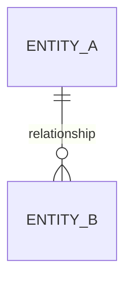

# Domain Model

The core entities, their relationships, and the invariants that must always hold.

## Entities

List each entity with its key attributes. Focus on what matters for understanding the domain — this is not a database schema.

| Entity | Key Attributes | Description |
|---|---|---|
| | | |

## Relationships

Describe how entities relate to each other.

| Relationship | Cardinality | Description |
|---|---|---|
| | | |

## Diagram

*Replace this placeholder with an actual diagram once entities and relationships are established.*

## Invariants

Rules that must always be true. These constrain how the system can evolve and must not be violated by any feature.

- 
